# 📊 Alphabet Inc. (GOOGL) — DCF 估值分析報告

> **分析日期**: 2026-04-03 | **資料來源**: Yahoo Finance (yfinance) | **估值引擎**: creating-financial-models DCF Suite

---

## 🎯 核心結論 (The Bottom Line)

| 指標 | 數值 |
|------|------|
| **當前股價** | **$295.77** |
| **DCF 內在價值 (Base Case)** | **$252.26** |
| **折溢價** | **-14.7% （目前高估）** |
| **85 折安全邊際目標價** | $214.42 |
| **80 折安全邊際目標價** | $201.80 |

> [!WARNING]
> 以基準情境 (Base Case) 計算，GOOGL 當前股價 $295.77 **高於** 模型估算的內在價值 $252.26，溢價約 14.7%。在當前價位進場不具備安全邊際。
>
> 但若市場持續看好 AI 帶動的高成長（Bull Case），則內在價值可達 $323，屆時現有價位反而偏低。**你對 Google AI 成長力度的判斷，將決定這筆投資的勝敗。**

---

## 📈 歷史財務數據 (Historical Financials)

> 單位：百萬美元 (M)

| 年度 | 營收 (Revenue) | EBITDA | EBITDA Margin | 資本支出 (CapEx) | CapEx 佔營收 |
|:----:|---------------:|-------:|--------------:|-----------------:|-------------:|
| 2022 | $282,836 | $85,160 | 30.1% | $31,485 | 11.1% |
| 2023 | $307,394 | $97,971 | 31.9% | $32,251 | 10.5% |
| 2024 | $350,018 | $135,394 | 38.7% | $52,535 | 15.0% |
| 2025 | $402,836 | $180,698 | 44.9% | $91,447 | 22.7% |

> [!NOTE]
> **關鍵觀察**：
> - 營收穩定成長，從 2022 到 2025 年 CAGR 約 **12.5%**。
> - EBITDA margin 從 30% 飆升到 **45%**，反映 AI 驅動的營運槓桿效果顯著。
> - 但 CapEx 佔營收比從 11% 暴漲到 **23%**——這是 Google 大量採購 GPU 伺服器建設 AI 基礎設施的真實寫照。這筆巨額支出是否能帶來對等的營收回報，是模型中最大的不確定性。

---

## 🔧 關鍵假設參數 (Key Assumptions)

### WACC (加權平均資金成本)

| 參數 | 數值 | 說明 |
|------|------|------|
| 無風險利率 (Rf) | 4.30% | 美國 10 年期公債殖利率 |
| Beta (β) | 1.112 | GOOGL 相對於大盤的波動度 |
| 市場風險溢酬 (MRP) | 5.50% | 股票市場超額報酬 |
| **股權成本 (Ke)** | **10.42%** | CAPM: Rf + β × MRP |
| 舉債成本 (Kd) | 3.50% | Google 信用評級 AA+，借貸成本極低 |
| D/E Ratio | 0.034 | 幾乎無槓桿的資本結構 |
| 有效稅率 | 13.5% | Google 全球稅務優化結果 |
| **WACC** | **10.17%** | 折現率 |

### 成長與獲利預估 (Base Case)

| 假設 | Year 1 | Year 2 | Year 3 | Year 4 | Year 5 | 備註 |
|------|:------:|:------:|:------:|:------:|:------:|------|
| 營收成長率 | 13% | 12% | 11% | 10% | 9% | AI 紅利遞減回歸常態 |
| EBITDA Margin | 36.4% | 37.4% | 38.4% | 39.4% | 40.4% | 利潤率緩步擴張 |
| CapEx 佔營收 | 14.8% | 14.8% | 14.8% | 14.8% | 14.8% | 基於歷史均值 |
| 永續成長率 (g) | | | | | **3.0%** | 全球 GDP 成長水準 |

---

## 💰 自由現金流推估 (FCF Projections)

> 單位：百萬美元 (M)

| 項目 | Year 1 | Year 2 | Year 3 | Year 4 | Year 5 |
|------|-------:|-------:|-------:|-------:|-------:|
| **營收** | $455,205 | $509,829 | $565,910 | $622,502 | $678,527 |
| **EBITDA** | $165,603 | $190,573 | $217,195 | $245,140 | $273,988 |
| **自由現金流 (FCF)** | **$55** | **$84,422** | **$99,854** | **$116,625** | **$134,545** |

> [!IMPORTANT]
> **Year 1 的 FCF 幾乎為零 ($55M)**，這是因為模型計入了巨額的營運資金變動（NWC 佔營收 27.5%）。
> 這反映了一個真實現象：Google 在 AI 擴張初期的現金消耗非常龐大。如果你認為 Google 的 NWC 比率不會維持在這麼高的水準（例如降至 20%），內在價值會大幅上修。

---

## 🏢 估值結果 (Valuation Summary)

| 項目 | 金額 (M) | 備註 |
|------|-------:|------|
| 未來 5 年 FCF 現值 (PV of FCF) | $306,344 | |
| 終值現值 (PV of Terminal Value) | $1,190,871 | 佔企業價值 **79.5%** |
| **企業價值 (EV)** | **$1,497,215** | |
| 減：淨負債 | -$28,583 | 總負債 $59.3B - 現金 $30.7B |
| **股東權益價值** | **$1,468,632** | |
| 流通在外股數 | 5,822M | |
| **每股內在價值** | **$252.26** | |

> [!NOTE]
> **終值佔企業價值的 79.5%**，這意味著 GOOGL 的估值高度依賴你對「長期」的信心。若你認為 Google 在 5 年以後的成長力道會更強（例如 AI 真正打開新市場），則終值會更高，反之則需更保守。

---

## 📐 敏感度分析矩陣 (Sensitivity Analysis)

> 每股內在價值（美元），**粗體**為基準情境

**行 = WACC（折現率）｜ 列 = 永續成長率 (Terminal Growth)**

| WACC ↓ \ g → | 2.0% | 2.5% | 3.0% | 3.5% | 4.0% |
|:---:|:---:|:---:|:---:|:---:|:---:|
| **8.17%** | $309 | $333 | $362 | $397 | $440 |
| **9.17%** | $261 | $278 | $298 | $321 | $349 |
| **10.17% (Base)** | $225 | $238 | **$252** | $269 | $288 |
| **11.17%** | $197 | $207 | $218 | $230 | $243 |
| **12.17%** | $175 | $182 | $191 | $200 | $210 |

> [!TIP]
> **如何閱讀此表**：如果你認為 Google 的真實折現率比我們算的更低（例如 8.17%），且永續成長率是 3.5%（高於 GDP），那麼 GOOGL 值 $397。反之，若市場進入升息循環使折現率升至 12%，且永續成長率只有 2%，GOOGL 僅值 $175。
>
> 當前股價 $295.77 大約落在 WACC=9.17% 且 g=3.0% 的交叉處，市場隱含的預期目前偏樂觀。

---

## 🎭 情境分析 (Scenario Analysis)

| 情境 | 營收成長 (Y1→Y5) | 永續成長率 | 每股價值 | vs 當前股價 |
|------|:-----------------:|:---------:|:--------:|:----------:|
| 🐻 **Bear（悲觀）** | 8% → 4% | 2.0% | **$166** | -43.8% |
| 📊 **Base（基準）** | 13% → 9% | 3.0% | **$252** | -14.7% |
| 🚀 **Bull（樂觀）** | 16% → 12% | 3.5% | **$323** | +9.3% |

```mermaid
gantt
    title GOOGL 股價 vs 估值區間
    dateFormat X
    axisFormat $%s
    section 估值區間
    Bear ($166)        :done, 0, 166
    Base ($252)        :active, 166, 252
    Current ($296)     :crit, 252, 296
    Bull ($323)        :milestone, 323, 323
```

---

## 🧠 投資啟示與行動建議

### 1. 現在該買嗎？
在基準情境下，**不建議在當前價位加碼**。$295 的價格已經超過 DCF 算出的公平價值 $252，沒有安全邊際。

### 2. 什麼價格才值得進場？
- **積極型投資人**（相信 Bull Case）：$252 以下可開始分批試探性建倉。
- **保守型投資人**（追求安全邊際）：等 $214（85 折）或 $202（80 折）再出手。

### 3. 模型的最大風險在哪？
- **CapEx 支出的回報率**：Google 年花 $900 億以上在 AI 基建上。如果這些投資無法轉換成營收，利潤率會快速惡化。
- **終值佔比過高 (79.5%)**：這代表模型對「長期」的信心非常敏感。如果你不確定 Google 10 年後是否還能稱霸，就應該用更保守的參數重新估算。

### 4. 你持有的 GOOGL 怎麼辦？
你目前持有 **8.02 股 GOOGL**（佔總資金約 5.4%），按照象限分類歸在「進攻」。
- 既然你已經持有，且部位不大，**繼續持有即可，但暫時不加碼**。
- 如果股價跌至 $252 以下（Base Case 公平價值），可以考慮利用戰爭回檔分批買入，加大到「進攻」象限的目標比重。

---

## 📎 技術附錄

- **估值引擎**: `creating-financial-models/dcf_model.py`
- **數據來源**: `yfinance` Python library (Yahoo Finance)
- **分析腳本**: [run_dcf_googl.py](file:///Users/zhangqixun/Documents/Google%20Antigravity/stock_US/run_dcf_googl.py)
- **原始輸出 JSON**: [googl_dcf_output.json](file:///Users/zhangqixun/Documents/Google%20Antigravity/stock_US/googl_dcf_output.json)
